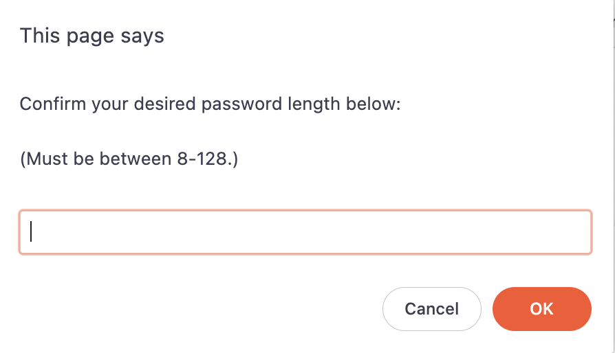
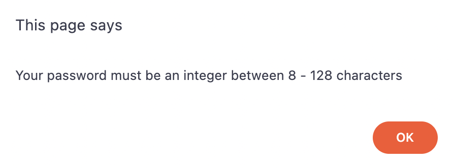
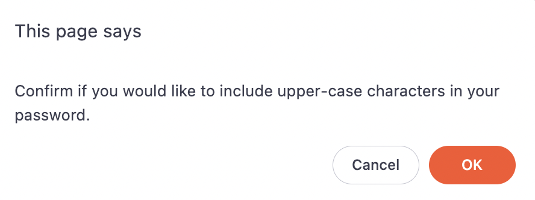
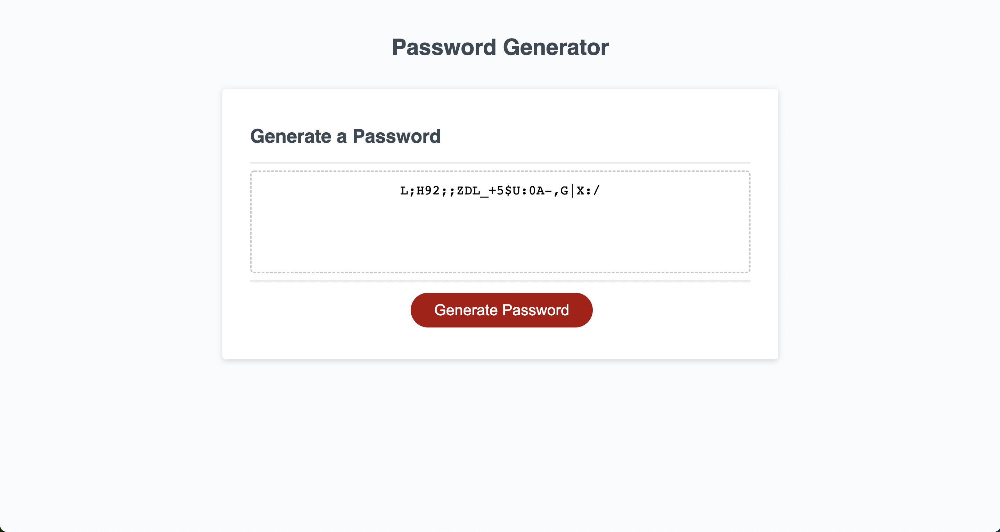

## Description

This is a random password generator. It makes a randomized password between 8 - 128 characters. It also allows the user to choose what kind of characters to include and exclue from the password.

## Usage

To start, the user should press the red "Generate Password" button at the bottom of the screen.

Then a promp window asks the user how long they want their password to be. They can only make a password that is between 8 and 128 characters long.

If the user does not submit an integer between 8 and 128, they will give a fail screen. For example, if the user were to submit "ten characters" this would give a fail screen. They should instead just type the number "10". 

The fail screen will also trigger if the user submits a fraction, decimal, a number outside of the specified range, or letters in the prompt.

After the user has decided on the desired length they will be prompted with 4 different windows in succession, allowing the user to decide what kind of characters to include in the password.

Pressing "OK" confirms that the user would like to include the above characters in their password.

Pressing "Cancel" excludes the characters and moves the user along to the next character type.

Following the upper-case prompt is a prompt for lower-case characters, numbers, and special characters in that order.

Once all the character option prompts have been run, the generator will supply the user with a password of their desired length and character selections.

The above example is the result of typing "25" in the password-length prompt, and clicking "OK" on the upper-case prompt, "Cancel" on the lower-case prompt, then "OK" on the numbers and special characters prompts.

The user can then select the password, copy it and set it for any login they may need.

## Credits

Credit to Kurt Bixby (https://github.com/kurtbixby) for helping with the some of the prompt language.

Also, thanks to the University of Texas for the initial CSS and HTML. 

The rest is mine.
